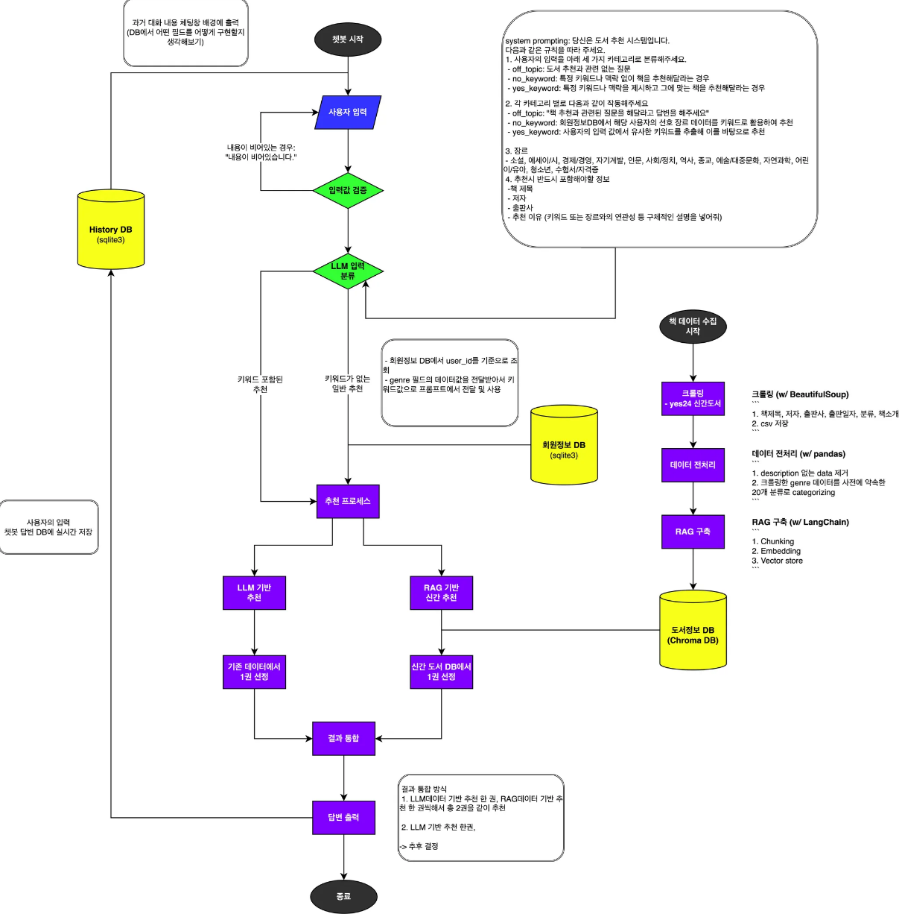

---
## :rocket: Dev Guide

1. [Introduction](#introduction)
2. [Team members](#team)
3. [Features](#기능-소개)
4. [Process Flow](#process-flow)
5. [ERD](#erd)
6. [Tech stacks](#tech-stacks)
7. [Project Directory Structure](#project-directory-structure)
---
## Introduction
#### Bookgroo는 키워드 기반 책을 추천해주는 챗봇 구현 project입니다
---
## Team

|Role        |Name      |GitHub        |Responsibilities |
|------------|----------|--------------|-----------------|
|team leader👑|**이고운**| [@dlrhdns75177](https://github.com/dlrhdns75177)|        |
|team member |**맹주형**| [@jhmang1128](https://github.com/jhmang1128)     |        |
|team member |**정지웅**| [@JaceJung-dev](https://github.com/JaceJung-dev) |        |
|team member |**최보근**| [@invisible-bo](https://github.com/invisible-bo) |        |
---
## 기능 소개
1. 회원가입, 로그인, 로그아웃, 회원탈퇴 기능 제공
2. 키워드를 포함한 책 질문 입력 시 적절한 책을 추천해주는 챗봇 구현

---
## Process Flow

---
## ERD

---
## Tech stacks
**Backend**
&nbsp;&nbsp;&nbsp;

**Frontend**
&nbsp;&nbsp;

**AI**
&nbsp;&nbsp;

**Version Control Systems**
&nbsp;

**Collaboration Tools**
&nbsp;

---
## Project Directory Structure
완성 후 작성
